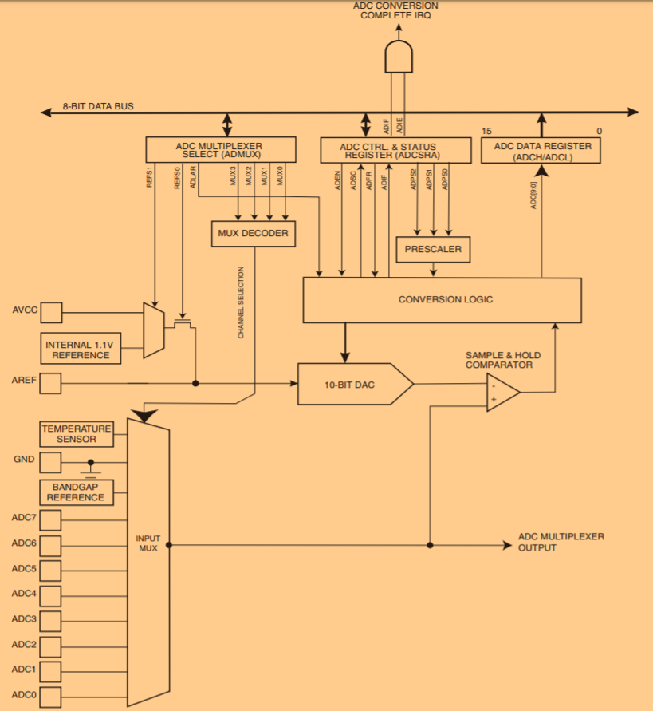

# Controle de luminosidade de um LED por Potenciômetro em Arduino

**Alunos:** 

    Marcelo Ferreira Cândido
    Renan Siman Claudino

## Objetivo
A prática proposta pela dupla objetiva, principalmente, controlar a luminosidade de um LED
através do uso de um potenciômetro linear utilizando o microcontrolador 
ATMEGA328-P conectado a uma placa Arduino, "plataforma de prototipagem eletrônica de código aberto". 
Tal prática já foi exibida em sala, contudo não em um Arduino. Dessa forma, tem-se como objetivos 
secundários 
1. implementar um circuito eletrônico básico, conhecendo-se mais sobre os componentes necessários; 
1. analisar o mais baixo nível (que a dupla conseguir) do microcontrolador abordado, visto 
    que a tecnologia Arduino é de alto nível, mascarando consideravelmente o funcionamento
    do microcontrolador.

## Materiais utilizados
Para a realização desse trabalho, a dupla utilizou:
1. Um potenciômetro de 10KΩ;
1. Um LED;
1. Um resistor de 330Ω;
1. Nove _jumpers_;
1. Uma _protoboard_.

## Metodologia
### Montagem do circuito (passo-a-passo)
Aqui a dupla descreverá as etapas necessárias para a implementação do circuito:
1. Conecte o LED à _protoboard_, sabendo que a perna maior se refere à alimentação e a outra 
    se refere ao aterramento;
1. conecte o resistor ligando a linha da _protoboard_ em que está o aterramento do LED a outra 
    linha qualquer;
1. conecte dois _jumpers_ à _protoboard_, um à saída do resistor e o outro à alimentação do LED. 
    O primeiro deve ser ligado ao aterramento da _protoboard_, o segundo deve ser ligado ao pino 
    **11** da placa Arduino;

4. conecte o potenciômetro à _protoboard_;
4. conecte os furos de aterramento e alimentação da _protoboard_ aos seus respectivos pinos do 
    potenciômetro utilizando _jumpers_;
4. conecte o pino de sinal do potenciômetro ao pino **A1** utilizando um _jumper_.


### A lógica por trás do projeto
O ATMEGA328-P possui um conversor analógico-digital (AD) de dez (10) _bits_. O seu esquema lógico 
pode ser visto na imagem abaixo. Esse conversor é a parte central da leitura do pino analógico **A1** 
onde o potenciômetro está conectado. Para a seleção desse pino (que, assim como o **11**, deve ser 
habilitado no início do código - **A1** como entrada, **11** como saída), os _bits_ `MUX3`, `MUX2`, `MUX1` e `MUX0` 
do registrador `ADMUX` (_AD Multiplexor Selection_) devem estar de acordo com a seleção do multiplexador 
do conversor para o dito pino, ou seja, habilitados de acordo com a numeração `0001`.

Uma das formas de se **iniciar uma conversão**, é habilitando-se os _bits_ `ADEN` (_AD Enable_) e `ADSC` 
(_AD Start Conversion_). Quando a conversão terminar, o _bit_ `ADIF` (_AD Interruption Flag_) do registrador
`ADCSRA` (_AD Control and Status_) será habilitado, sendo necessário desabilitá-lo para iniciar uma nova 
conversão. Além disso, o _bit_ `ADSC` será desabilitado. O resultado da conversão poderá ser encontrado 
nos registradores de dados `ADCL` e `ADCH`, que devem ser lidos nessa ordem se o ajustamento for 
configurado à direita. Todo esse funcionamento é encapsulado na função `analogRead(pinoEmQuestao)` do 
Arduino, sendo o valor retornado para uma variável, no caso desse trabalho.



Após a leitura do sinal obtido do potenciômetro, é necessário se utilizar o valor desse sinal para 
corresponder à quanta tensão deve ser passada para o LED, controlando-se assim, sua luminosidade. 
Mais uma vez, a plataforma Arduino cria facilidades com a existência de pinos adaptados à modulação 
por largura de pulso (PWM, do inglês). O pino **11**, utilizado para a conexão do LED, é um exemplo desses.

Existem, pelo menos, duas formas de se implementar PWM no Arduino, como se pode ver nesse
[link](https://www.arduino.cc/en/Tutorial/SecretsOfArduinoPWM). Optamos pela primeira forma, 
consequentemente mostrando mais das já citadas facilidades da plataforma. Como demonstrado no código 
abaixo, a estratégia consiste em ligar e desligar o pino do LED (realizado através da função 
`digitalWrite(pino, sinalLogico)`) com um determinado intervalo de tempo (em us), levando a uma tensão 
média que determina a luminosidade do diodo emissor de luz.
```C++
digitalWrite(13, HIGH);
delayMicroseconds(100);
digitalWrite(13, LOW);
delayMicroseconds(1000 - 100);
``` 

Nesse trabalho, o valor de tempo que o LED permanecerá ligado/desligado será determinado pelo valor 
lido do potenciômetro. Para tal, após a leitura do pino e o armazenamento do seu valor, a dupla mapeou 
(com a ajuda da função `map(valorAMapear, inicioRef1, fimRef1, inicioRef2, fimRef2)`) esse valor de uma 
escala de 0 a 1023 (visto que o conversor AD possui dez _bits_ e 2^10 = 1024) para uma escala de 
0 a 100000, de tamanho considerável para garantir que o LED fique tempo acesso o bastante para 
fornecer boa quantidade de luminosidade. Com isso, tem-se o ocódigo
```C++
adcOut = analogRead(POT);

adcOutMapped = map(adcOut, 0, 1023, 0, 100000);

digitalWrite(LED, HIGH);
delayMicroseconds(adcOutMapped);
digitalWrite(LED, LOW);
delayMicroseconds(adcOutMapped);
```

## Resultados e observações
Após realizado a montagem do circuito e carregado o código na placa foi observado que ao 
rotacionar o potenciômetro em um determinado giro, a frequência do LED foi alterada. O valor do _duty cycle_ 
variava de 0% a 50% do ciclo (aferido com osciloscópio). Além disso, observou-se que entre a posições 
angulares inicial e final do potenciômetro houveram cerca de cinco vezes o reinício da escala de 0% a 50%. 
Para simular a aplicação desses resultados foi utilizado o PicSimLab, visto que o Proteus parecia não 
responder corretamente.

Ainda não se sabe o motivo da escala ir apenas até 50% da tensão de 5V fornecida pela plataforma Arduíno 
e nem porque a escala se repetia várias vezes dentro do ângulo do potenciômetro.  


## Referências
